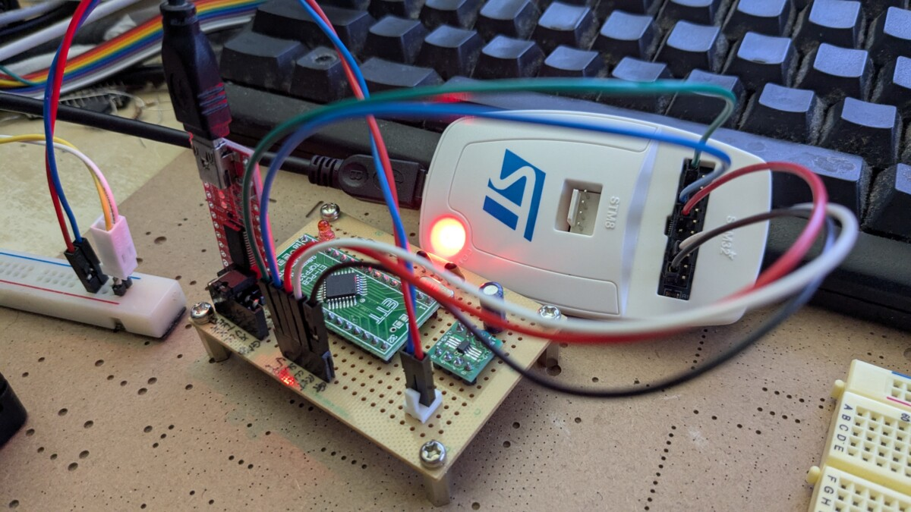
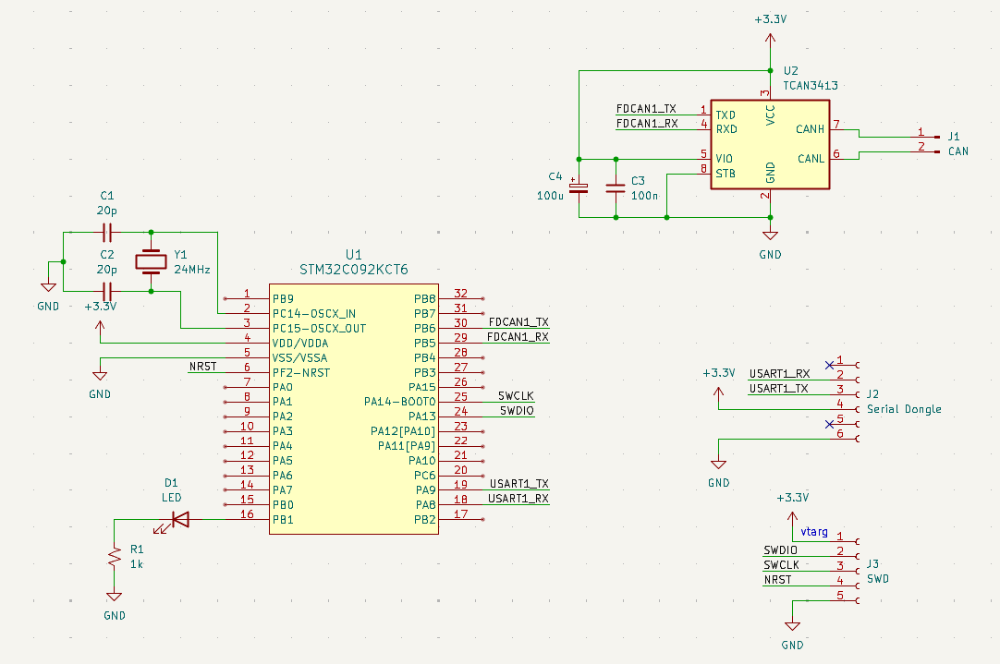

# CAN Monitor

This is a project to build a simple CAN bus monitor.
The module uses an FTDI compatible USB to UART adapter for interface to PC
as well as power supply.



## How To Use

The adapter must support 3.3V mode as the module works
only with 3.3V supply.

Installation Steps:

- Connect the CANH and CANL ports to the CAN bus to monitor.
- Connect the USB to UART adapter dongle to the module.
- Open a terminal that supports serial interface on the host PC
(e.g. [teraterm](https://github.com/TeraTermProject/teraterm/releases)).
Configure the serial interface as following:<br />
speed: 115200<br />
data: 8 bit<br />
parity: none<br />
stop bits: 1 bit<br />
flow control: none

Then the module starts monitoring the CAN bus. Following is an example output:

```
******************************
  CAN Bus Monitor
******************************

(fb) std [ 700 ]: 03 02
(c-) ext [ 1851f42d ]: 01
(f-) std [ 700 ]: 01
```

where the flag f/c indicates whether the frame was FD or classic.
The flag b/- indicates the message was sent using Bit Rate Switching.

If you type "tx" in the terminal, the monitor sends a test classic standard
frame of identifier 0x6ad with 2-byte data [0x41, 0x26]. There is another command
which is "txfd" that sends an FD standard frame with BRS. Type "help" for more
commands.

## Firmware

STM32C092KCT6 is used for the microcontroller. The module has an SWD port and
is programmable by an ST-LINK/V2 compatible programmer.

## Schematic

A KiCAD project is available in directory `kicad/` (schematic only).



## TODO
- Add support for monitoring remote frames
- More user commands