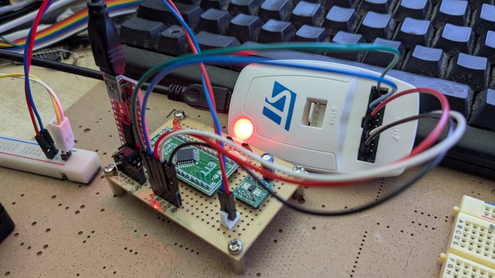
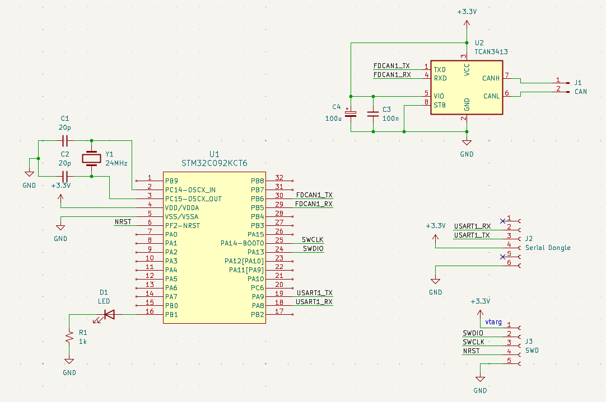

# CAN Monitor

This is a project to build a simple CAN bus monitor.
The module uses a FTDI compatible USB to UART adapter for power supply
and user interface.



## How To Use

The adapter must support 3.3V mode as the module works
only with 3.3V supply.

Installation Steps:

- Connect the CANH and CANL ports to the CAN bus to monitor.
- Connect the USB to UART adapter dongle to the module.
- Open a terminal that supports serial interface on the host PC
(e.g. [teraterm](https://github.com/TeraTermProject/teraterm/releases)).
Configure the serial interface as following:<br />
speed: 115200<br />
data: 8 bit<br />
parity: none<br />
stop bits: 1 bit<br />
flow control: none

Then the module starts monitoring the CAN bus. Following is an example output:

```
******************************
  CAN Bus Monitor
******************************
std[ 07 00 ]: 03 01
std[ 07 01 ]: 01
ext[ 18 51 f4 2d ]: 01
std[ 07 00 ]: 02 18 51 f4 2d 01
```

If you type "tx" in the terminal, the monitor sends a test standard frame
of identifier 0x303 with 4-byte data [0xde, 0xad, 0xbe, 0xef].

## Firmware

STM32C092KCT6 is used for the microcontroller. The module has an SWD port and
is programmable by an ST-LINK/V2 compatible programmer.

## Schematic

A KiCAD project is available in directory `kicad/` (schematic only).


